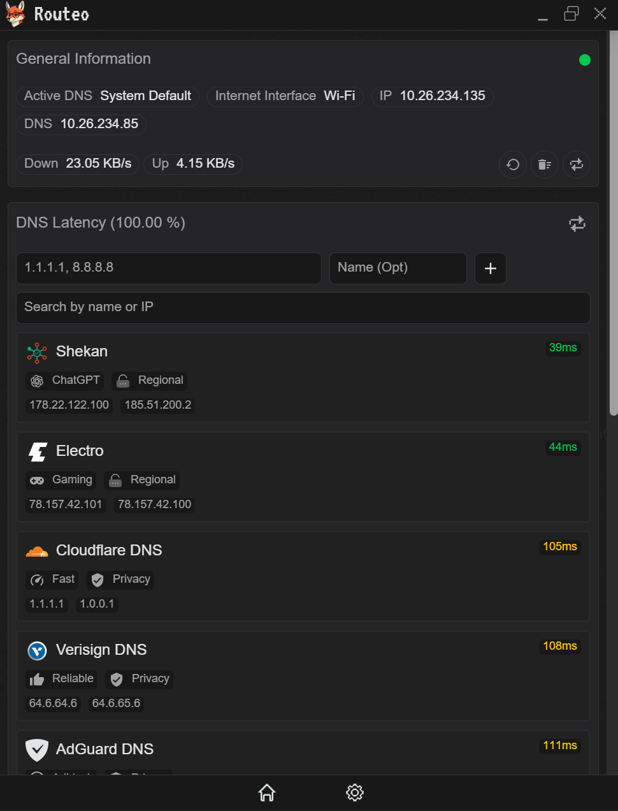

# Routeo

<p align="center">
  
</p>

<h1 align="center">Routeo</h1>

<p align="center">
  Fast desktop DNS manager built with Tauri + Nuxt.
</p>

<p align="center">
  Benchmark DNS latency, switch providers instantly, manage presets, and flush cache — all from a clean native desktop app.
</p>

<p align="center">
  <a href="LICENSE">
    
  </a>
  
  
  
  
  
</p>

---

## Why Routeo?

Changing DNS settings manually is annoying.

Operating systems hide network settings behind multiple menus, benchmarking tools are usually CLI-only, and testing multiple providers is slow and tedious.

Routeo makes DNS management fast, visual, and practical.

* Compare DNS providers with accurate latency testing
* Switch resolvers instantly
* Save your own presets
* Inspect active interfaces and DNS state
* Flush cache without terminal commands
* Monitor network activity in real time

Built as a lightweight native desktop app using Rust + Tauri.

---

## Screenshots

### Main dashboard



---

## Features

### DNS latency benchmarking

Sequential resolver testing for more reliable measurements without artificial congestion.

* Compare providers side-by-side
* Measure average latency
* Detect slow or unstable resolvers

### One-click DNS switching

Quickly apply popular DNS providers:

* Cloudflare
* Google DNS
* Quad9
* OpenDNS
* AdGuard DNS
* NextDNS
* Regional/community presets

### Custom DNS presets

Save your own resolver combinations locally.

Perfect for:

* development environments
* privacy-focused setups
* gaming
* regional DNS optimization

### Network visibility

Inspect:

* active network interface
* local IP addresses
* current DNS servers
* connection status

### Cache utilities

* Flush DNS cache
* Restore system defaults
* Refresh interface state

### Live traffic monitoring

Real-time upload/download indicators directly inside the app.

### Integrated log viewer

Inspect backend logs from the Tauri runtime for debugging and diagnostics.

---
## Compatibility

### Operating systems

| Platform | Status | Notes |
|---|---|---|
| Windows 10/11 | ✅ Supported | Uses native Windows DNS APIs |
| Ubuntu 24.04+ | ✅ Fully tested | Recommended Linux distribution |
| Debian-based Linux | ✅ Supported | Tested with NetworkManager |
| Arch Linux | ⚠️ Experimental | May require manual resolver configuration |
| Fedora | ⚠️ Experimental | Network stack differences possible |
| macOS | 🚧 Planned | Not yet implemented |

---

### Linux networking support

| Backend | Status |
|---|---|
| NetworkManager | ✅ Supported |
| resolv.conf | ✅ Supported |
| systemd-resolved | ⚠️ Partial |
| netplan | ⚠️ Depends on configuration |

---

### Architectures

| Architecture | Status |
|---|---|
| x86_64 | ✅ Supported |
| ARM64 | 🚧 Planned |

---

### Installer formats

| Platform | Formats |
|---|---|
| Windows | NSIS, MSI |
| Linux | deb |

---

### Permissions

Changing DNS settings may require elevated permissions depending on your operating system.

- Windows → UAC prompt
- Linux → sudo / PolicyKit
- Some sandboxed desktop environments may restrict network configuration access

---

### Known limitations

- VPN software may override DNS changes
- Some Linux distributions regenerate `resolv.conf`
- DNS changes may take a few seconds to propagate
- Split-tunnel VPN configurations can produce inconsistent benchmarking results

---

## Roadmap

### Planned

- [ ] Automatic update system
- [ ] System tray integration
- [ ] Background DNS monitoring
- [ ] DNS leak testing
- [ ] DNS over HTTPS (DoH)
- [ ] DNS over TLS (DoT)
- [ ] Import/export presets
- [ ] Resolver recommendation engine
- [ ] Multi-language support
- [ ] macOS support
- [ ] Startup launch option
- [ ] Connection change detection
- [ ] Per-interface DNS configuration
- [ ] Benchmark history & charts
- [ ] Custom themes
- [ ] Portable mode
- [ ] CLI companion utility

### Long-term ideas

- [ ] Resolver health monitoring
- [ ] Privacy scoring for DNS providers
- [ ] Self-hosted sync
- [ ] Team/shared presets
- [ ] Network diagnostics toolkit
- [ ] Public DNS provider registry


## Tech Stack

* Rust
* Tauri 2
* Nuxt 4
* Vue 3
* Bun
* Tailwind CSS

---

## Development

### Prerequisites

Install:

* Rust ≥ 1.90
* Bun
* Tauri prerequisites for your operating system

### Clone repository

```bash
git clone https://github.com/routeo/routeo.git
cd routeo
```

### Install dependencies

```bash
bun install
```

### Run development environment

Frontend:

```bash
bun run dev:ui
```

Desktop shell:

```bash
bun run dev:tauri
```

Or run both simultaneously:

```bash
bun run dev
```

---

## Production Build

```bash
bun run build
```

Generated installers:

* Windows → NSIS / MSI
* Linux → deb

---

## Project Structure

```txt
routeo/
├── packages/
│   ├── ui/                # Nuxt frontend
│   │   ├── app/
│   │   │   ├── pages/
│   │   │   ├── components/
│   │   │   └── composables/
│   │
│   └── tauri/             # Rust backend
│       └── src/
│           ├── commands/
│           └── logging.rs
```

---

## Contributing

Contributions are welcome.

Please read [CONTRIBUTING.md](CONTRIBUTING.md) before opening issues or pull requests.

Areas that especially help:

* macOS support
* UI/UX improvements
* additional DNS providers
* benchmarking improvements
* localization
* packaging/distribution

---

## Security

If you discover a security issue — especially around privilege escalation or system DNS modification — please review [SECURITY.md](SECURITY.md).

---

## Disclaimer

Routeo modifies system DNS settings.

Always verify:

* resolver trustworthiness
* privacy policies
* active DNS configuration after changes

Routeo does not operate or audit third-party DNS providers.

Use at your own risk.

---

## License

MIT © Saeid Zareie
